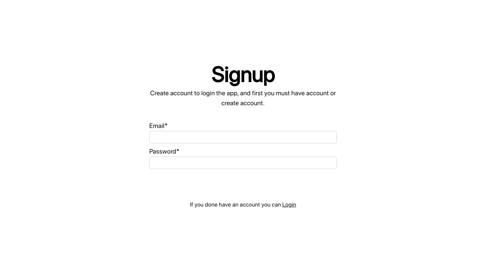
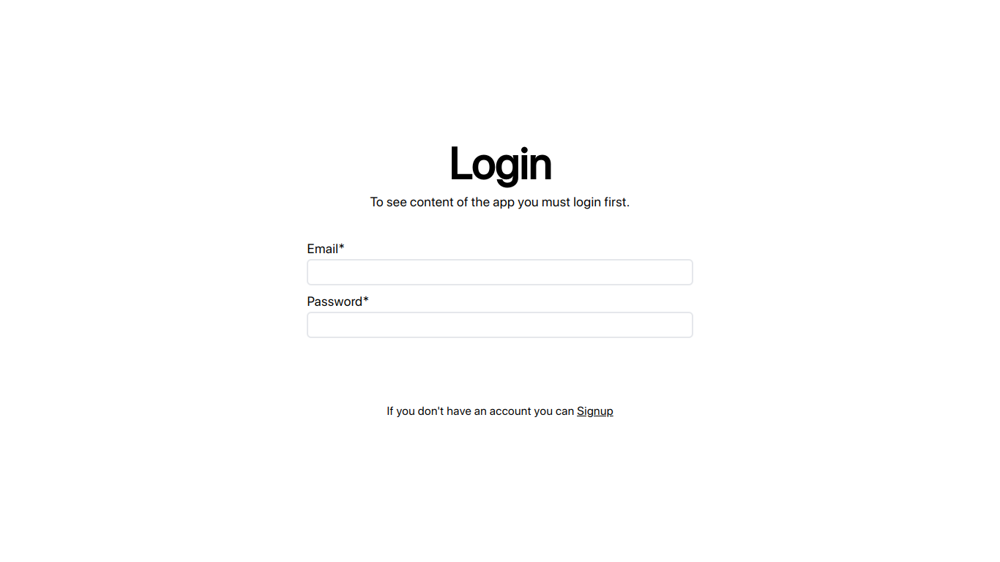
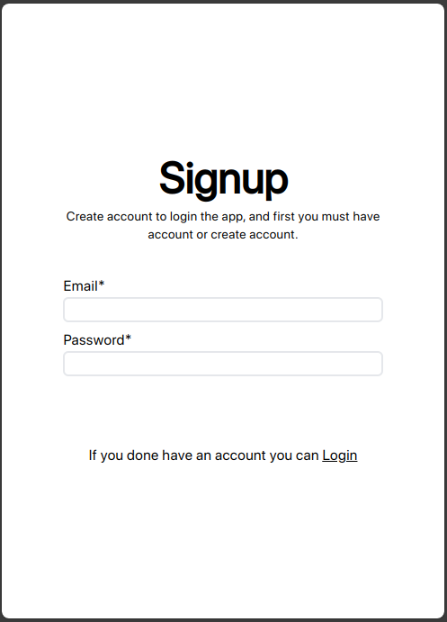
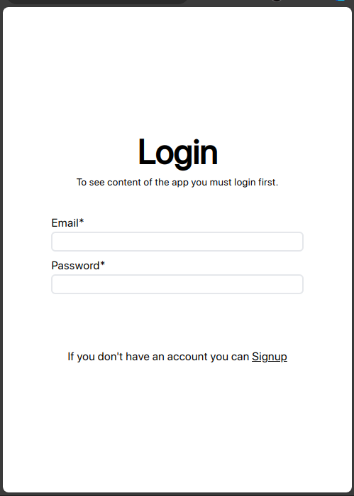

# Authentication mini-project
Small application that performs authentication. Login and Signup using the help of JSON Web Token, Bcrypt, and MySQL.

## Desktop view

This application has a very simple theme, referring to Apple's appearance or design. Although there are still many drawbacks, such as the colors being too bright, which can damage the eyes a bit.

## Mobile view

## Final
From this project we can learn about hashes, tokens, compare passwords, and so on regarding user passwords. But from here also handling user passwords is very crucial and you have to be careful

## Tech Stack

**Client:** React, TailwindCSS, Framer Motion

**Server:** Node, Express, MySQL