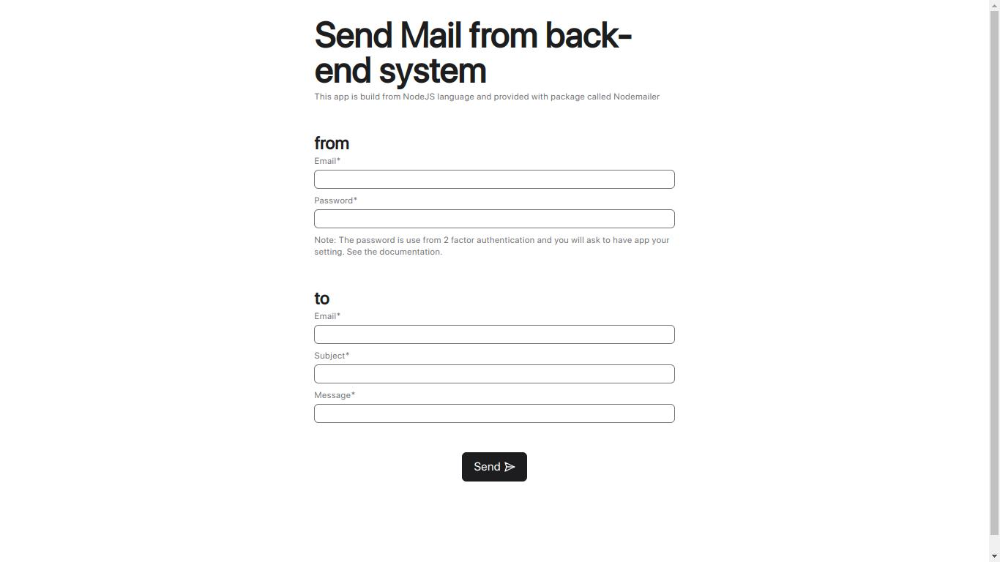
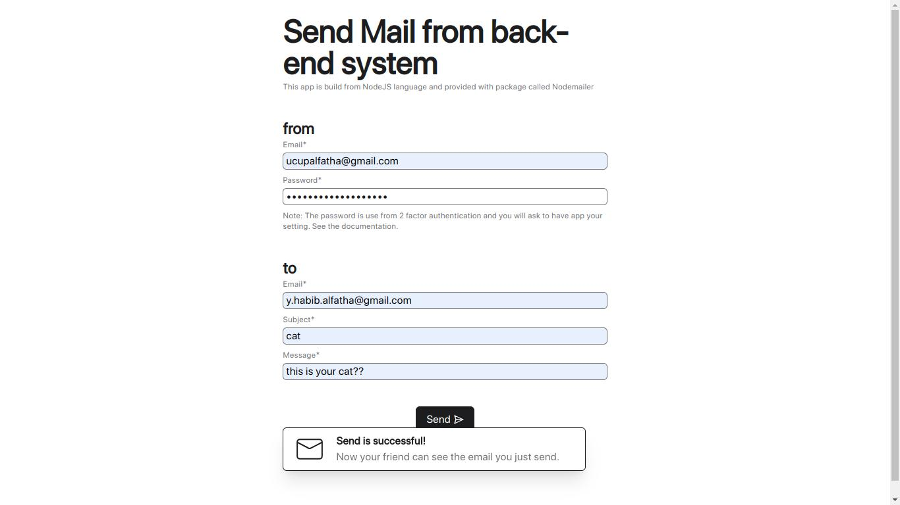
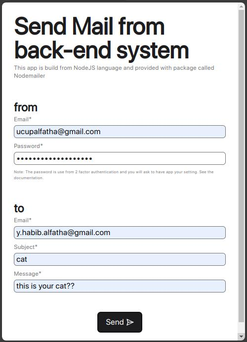

# Sendmailer mini-project
Small application that functions to send emails via a backend server. What is needed is a Google password that uses 2-authentication in the form of a 16 digit code.

## Desktop view

This application has a very simple theme, referring to Apple's appearance or design. Although there are still many drawbacks, such as the colors being too bright, which can damage the eyes a bit.

## Mobile view

## Final
From this small project we learn about the columns and configurations needed to send emails via source code. Such as columns for text in HTML form, recipient email, password, and so on as needed when you want to send email via Google.

## Tech Stack

**Client:** React, TailwindCSS, Framer Motion

**Server:** Node, Express, MySQL, Sendmailer