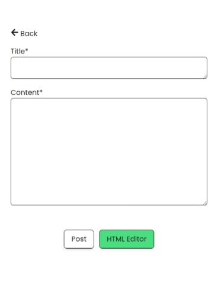

# Blogger mini-project
This application is a mini blogger, its features are posting, editing posts, and deleting posts. It's very simple, what I made aims to write about the technicalities in writing programs that I often forget but are important. So I am interested in creating a blog in mini form.

## Desktop view

The appearance is also very simple because to make the user focus on some writing in the middle of the screen and the blog content must only be the point.

## Mobile view

## Final
From this application I learned about a CRUD system in a database and also inputting long text and making complex applications that can look simple.

## Tech Stack

**Client:** React, TailwindCSS, Framer Motion

**Server:** Node, Express, MySQL, Sendmailer