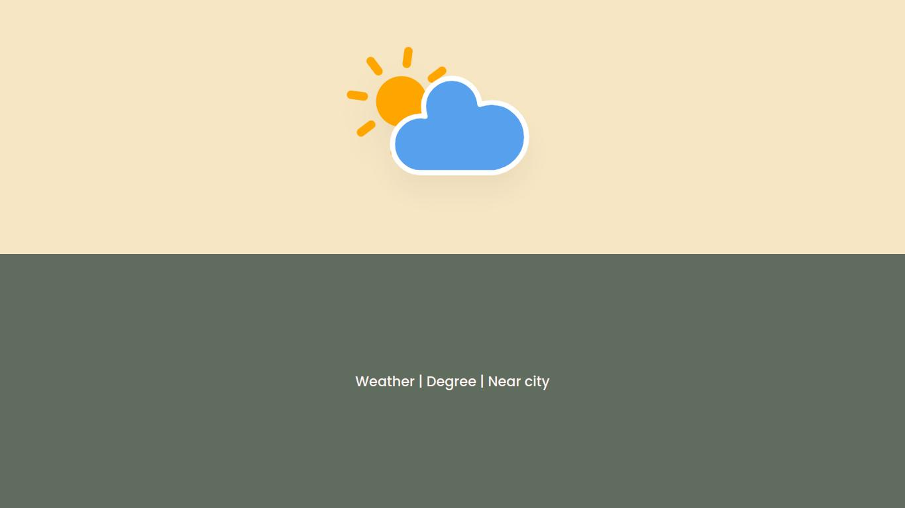
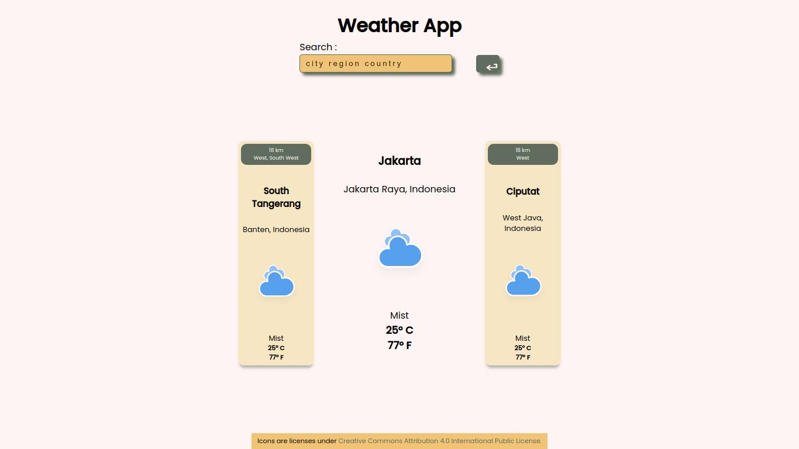
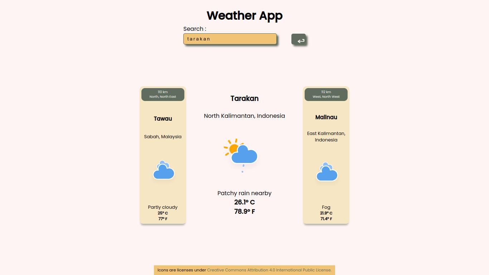
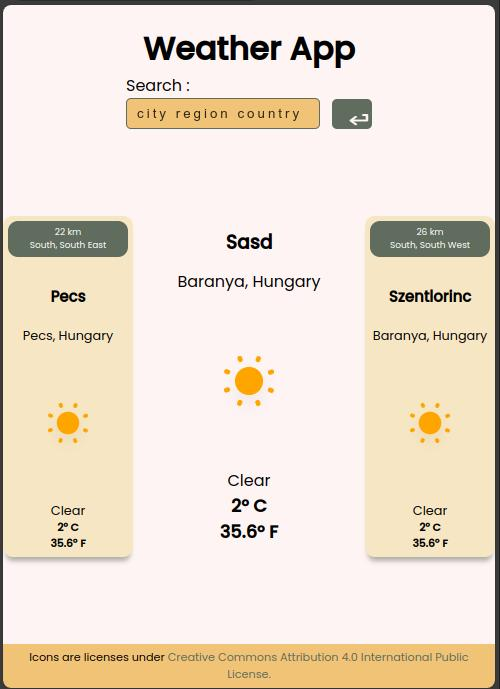

# Weather mini-project
The application tells the story of searching for the weather status of the city you are looking for and provides the same information for the 2 closest cities. I do this to make it easier if we are traveling, so we can find out the weather in the nearest city we are going to.

## Desktop view

For the appearance design I used soft or cream colors, as well as providing contrast in dark green for several components. And the icon I got for free can move like a gif.

## Mobile view

## Final
This application still has some limitations in the speed of searching for information, and several additions to the display will provide a better experience.

## Tech Stack

**Client:** React, Sass
