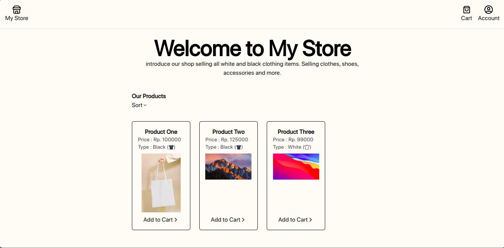
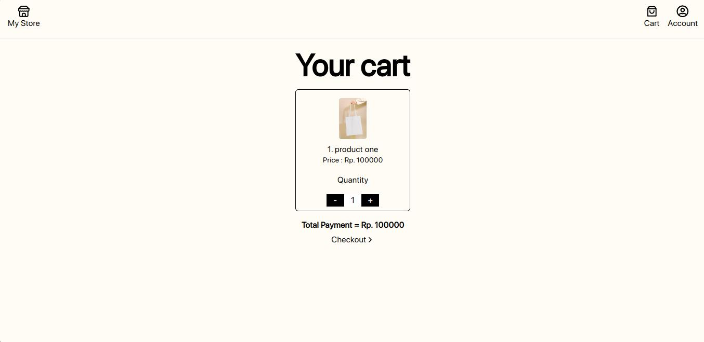
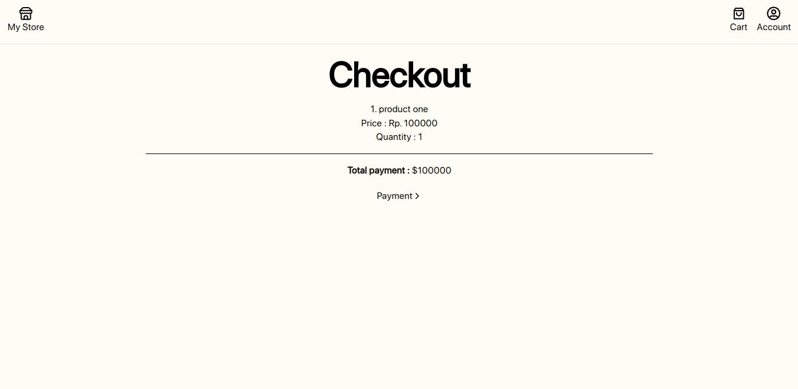
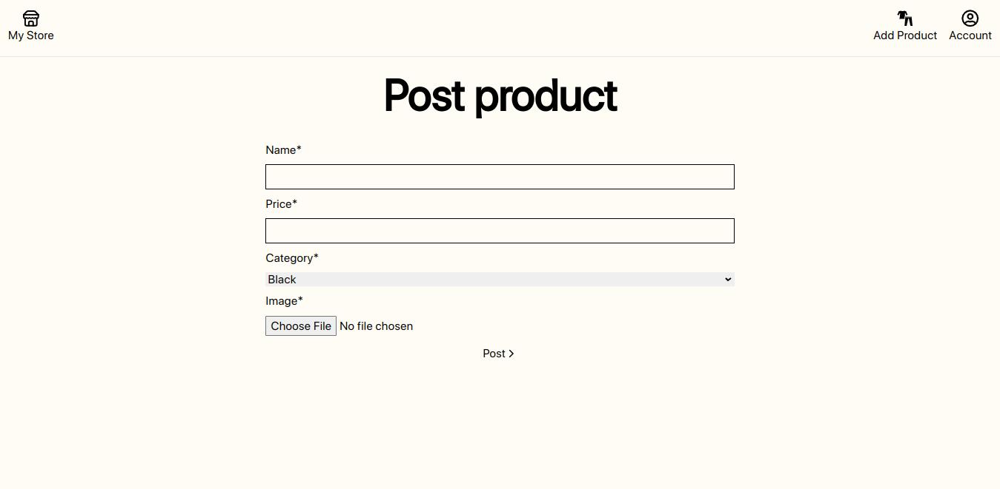

# Simple ecommerce app
Developing a comprehensive ecommerce application, particularly when it comes to intricate functionalities like cart management and discounts, can be quite challenging. The implementation of such features serves as a test of our skills and logical thinking.

## Desktop View
   

## Process
While it's easy to adopt existing best practices for simpler tasks, I chose to challenge myself by building these features from scratch in this application. Leveraging React JS, I found it straightforward to implement using Context. 

Each product is assigned a unique ID, streamlining the calculation process for the user's profile. During the calculation phase, accessing Context data allows for easy computation, referencing the ID and price attributes to calculate the total product price.

## Final
Although this application is intentionally basic, serving primarily as a platform to refine my understanding of ecommerce cart features, it has significantly deepened my familiarity with React JS. The hands-on experience gained through this project has made the overall process of creating applications more manageable.

## Tech Stack

**Client:** React, TailwindCSS, Framer Motion

**Server:** Node, Express, MySQL

